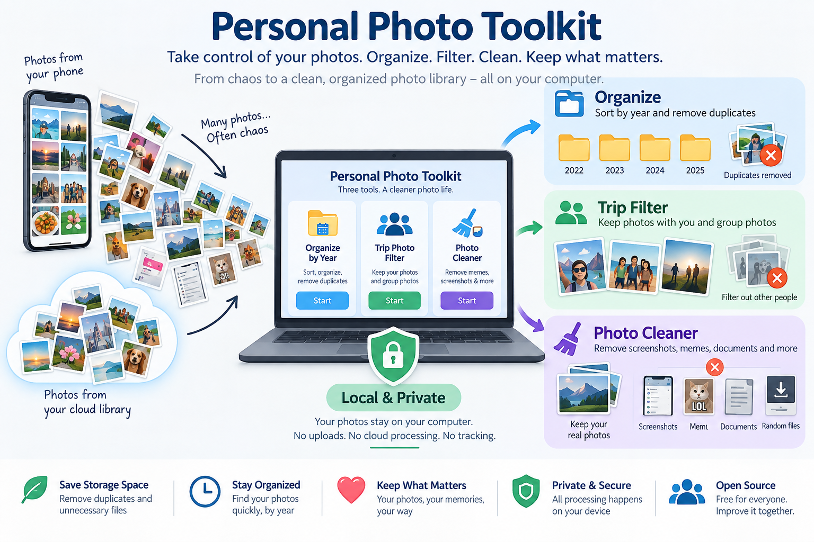

# 📸 Personal Photo Toolkit

<p align="center">
  
</p>

<p align="center">
  <strong>Turn years of phone, cloud and hard-drive photo chaos into an organized local library.</strong><br>
  Windows • macOS • Linux • Local-first • Open source • Originals are never automatically deleted
</p>

---

## Modular installation and in-app setup

The source setup installs only the small core required for **Organize by Year**. It no longer installs both AI stacks automatically.

- The initial source setup installs only the core application.
- When **Trip Photo Filter** is selected for the first time, the GUI can ask permission to install its optional InsightFace/ONNX/OpenCV feature pack. The face model is downloaded separately on first use.
- When **Photo Cleaner** is selected for the first time, the GUI can ask permission to install its optional PyTorch/Transformers/CLIP feature pack. The CLIP model is downloaded/cached on first use.

The old feature-install scripts remain useful for developers and troubleshooting, but ordinary source users should not need to search for them manually. Installing one optional feature does **not** require installing the other.


## Why I built this

Modern phones capture high-resolution photos and videos, which means a normal camera roll can grow by many gigabytes surprisingly quickly. The same collection is often synchronized to a cloud photo service, where available storage is also limited. Eventually the phone fills up, the cloud account approaches its storage limit, and the same memories may also be scattered across old computers, WhatsApp folders and external drives.

This project started from a practical workflow: **export the cloud library, copy the phone library to a computer, combine it with existing photo folders, organize everything locally, and then archive it to storage you control.**

For example, Google Photos can be exported with **Google Takeout**. Phone photos/videos and older folders can then be copied to the computer and processed together:

```text
📱 Phone photos & videos ────────┐
                                 │
☁️ Google Photos / Takeout ──────┼──► 📂 Personal Photo Toolkit
                                 │              │
💻 Existing / old photo folders ─┘              │
                                                ▼
                                      Organized Archive
                                                │
                         ┌──────────────────────┼──────────────────────┐
                         ▼                      ▼                      ▼
                      💾 HDD/SSD             🖥️ NAS               ☁️ Cloud
                         │                                             │
                         └──────── optional independent backup ────────┘
```

Instead of moving one large, messy folder from the phone or cloud to an external disk, Personal Photo Toolkit prepares a more useful archive: photos and videos can be separated and organized by year, exact duplicate files can be skipped, trip collections can be filtered, and screenshots/memes/documents/random downloads can be separated from personal memories.

After the archive has been copied and **you have verified that the files you care about are safely stored**, you decide what happens next. You may keep the originals on the phone/cloud, remove some of them to reclaim space, or use another storage location as an additional backup. The toolkit does not automatically delete the source collection.

### 💾 You choose where your archive lives

Personal Photo Toolkit organizes the collection; **it does not prescribe where you must store it**. The result can live on an HDD, SSD, NAS, another computer, or a cloud-storage provider. If desired, you can also keep a second independent copy in another location.

Archives may be packaged into ZIP files for easier transfer or storage, but a ZIP file by itself is not redundancy. If an HDD/SSD is the only copy and that device fails, the archive can still be lost. Users are responsible for choosing and verifying a storage/backup strategy appropriate for their files before deleting original copies.

The project therefore follows a simple principle:

> **Organize locally. Store where you want. Keep control of your files.**

## ✨ Three tools, one app

| Tool | Problem it solves | Typical result |
|---|---|---|
| **1. Organize by Year** | Photos from several devices/exports have mixed folders, duplicate files and unreliable filesystem dates. | `Photos/2024`, `Videos/2024`, etc., with exact duplicates skipped and a report. |
| **2. Trip Photo Filter** | A shared trip folder contains your photos, group photos, friends-only photos and scenery. | `Photos/Keep`, `Photos/Review`, `Photos/Other-People`, `Photos/No-People`; videos are preserved separately in `Videos/Unfiltered`. |
| **3. Photo Cleaner** | Screenshots, memes, documents and random downloads are mixed with memories. | Personal/travel photos separated from clutter under `Photos/`; videos are preserved separately in `Videos/Unfiltered`. |

> **Safety principle:** the toolkit copies results to a destination folder. It does not intentionally delete your original media. Review the result before removing anything yourself.

---

# 1️⃣ Organize by Year

Select a source such as a phone backup, Google Photos Takeout, camera folder or old disk. The organizer recursively scans supported media and creates a predictable structure:

```text
My-Photo-Library/
├── Photos/
│   ├── 2022/
│   ├── 2023/
│   ├── 2024/
│   └── Unknown/
├── Videos/
│   ├── 2022/
│   ├── 2023/
│   └── 2024/
└── _PhotoSorter-Reports/
```

### Choosing the year

Dates are not guessed from one field. The toolkit checks stronger evidence first, including Google Photos Takeout sidecar metadata, embedded image/video metadata, dates encoded in common camera/WhatsApp filenames, and only then weaker filesystem timestamps.

Examples:

```text
IMG_20240306_190402.jpg   → 2024
IMG-20200329-WA0020.jpg   → 2020
VID_20230512_143000.mp4   → 2023
IMG_4198.jpg              → inspect metadata; filename alone is insufficient
```

### Duplicate protection

Exact duplicates are detected using **SHA-256 content hashes**. A byte-for-byte duplicate is skipped and recorded in the report. Near-duplicates are deliberately *not* deleted automatically: a crop, edit, WhatsApp-compressed copy or burst photo may still matter to you.

---

# 2️⃣ Trip Photo Filter

Imagine five friends share all their photos after a holiday. You may want only:

- photos of yourself;
- selfies;
- group photos where you appear;
- and optionally a separate folder for scenery/no-person photos.

Select **5–10 clear solo reference photos** of the person you want to find. The same app therefore works for you, a friend or another family member—the reference person is selected locally each time.

```text
Trip-All-Media/
        │
        ▼
Reference person + local face matching
        │
        ├── Photos/
        │   ├── Keep/          strong match
        │   ├── Review/        uncertain match
        │   ├── Other-People/  people, but no strong reference match
        │   └── No-People/     no face detected
        └── Videos/
            └── Unfiltered/    preserved separately; not face-classified yet
```

### Face model

The current high-accuracy mode uses **InsightFace `buffalo_l`**: SCRFD-10GF face detection plus a ResNet50 recognition model. The upstream model pack is about **326 MB**. It is not bundled in this repository; the UI explains the download and asks before first use.

Face matching is probabilistic. Small, blurred, dark, occluded or strongly rotated faces can still be missed or misidentified. `Review` exists for this reason.

### Real accuracy measurement

A similarity score is **not** an accuracy percentage. If you want to measure performance for your own collection, optionally provide two small validation folders that are different from the reference photos:

```text
Validation_Positive/  # selected person definitely appears
Validation_Negative/  # selected person definitely does not appear
```

Enable **Auto-calibrate and create Accuracy_Report.txt**. The app then evaluates thresholds and reports accuracy, balanced accuracy, precision, recall, F1, false-accept rate and false-reject rate for *your labeled validation set*. It also uses the calibrated threshold for the trip run.

---

# 3️⃣ Photo Cleaner

The cleaner is for the clutter that gradually enters a camera/photo library:

```text
Photos/
├── Keep-Personal/
├── Keep-Travel-Scenery/
├── Memes/
├── Screenshots/
├── Documents/
├── Random-Downloads/
└── Review/
Videos/
└── Unfiltered/
```

### Cleaner v2: conservative multi-stage classification

Cleaner no longer treats CLIP as the only decision maker. It first uses inexpensive evidence such as strong filename patterns, EXIF/camera metadata and screenshot dimensions. Images that still need semantic understanding are analyzed with the existing local CLIP model. Category prompts are aggregated before the final decision, and ambiguous results are deliberately routed to `Review` instead of being confidently placed in an unwanted category.

This design is intended to improve useful classification **without adding another large AI model**. It also keeps the important safety rule: no source photo is automatically deleted.

Three processing modes are available:

- **Fast** — smaller analysis copies and less conservative thresholds.
- **Balanced (recommended)** — good compromise between speed and cautious classification.
- **Maximum precision** — larger analysis copies and stricter confidence/margin requirements; more borderline files may go to `Review`.

The CSV report records the category, confidence and reason. Progress also reports photos/second and ETA. AI can still make mistakes, and the project does not claim a fixed accuracy percentage without a labeled evaluation set.

### Videos are never mixed with analyzed photos

The current Trip Filter and Photo Cleaner AI pipelines analyze still images. Videos are **not silently discarded and are not falsely labeled as AI-reviewed**. They are copied into a separate `Videos/Unfiltered/` folder. A future release can add optional frame sampling for video face matching and video cleaning.

---

## 🔒 Privacy / Datenschutz by design

The project is designed to be **local-first**:

- selected photos and videos are processed on your computer;
- reference photos and face embeddings are not intentionally uploaded to the project maintainers;
- there is no account, advertising SDK or telemetry enabled by this project by default;
- user photos are not used to retrain the underlying AI models;
- optional AI model files may need a one-time internet download;
- the UI asks before the first large AI-model download;
- originals are not automatically deleted.

Face recognition can involve biometric personal data depending on the purpose and context. Users and redistributors are responsible for ensuring that their use has an appropriate legal basis and complies with applicable law.

Read the full **[Privacy / Datenschutz notice](PRIVACY.md)** before using face matching in a shared, organizational or otherwise sensitive setting.

---


## 💽 Approximate installation size

The toolkit is modular, so you do not need all AI components just to use **Organize by Year**. Exact disk usage varies by operating system, Python/package versions and model cache format. As a practical planning estimate:

| Installation | Approximate local disk usage |
|---|---:|
| Core + Organize by Year | **under ~0.1 GB** in a normal source environment |
| Trip Filter additions + `buffalo_l` model | **roughly ~0.7–1.2 GB additional** |
| Photo Cleaner additions + CLIP model | **roughly ~1.0–1.8 GB additional** |
| All three tools together | **roughly ~2–3 GB installed/cached** |

Temporary installer/download caches can make the peak usage higher, sometimes around **3–5 GB**. These are planning estimates rather than guaranteed package sizes. The user's own photos and generated output are separate and can of course require much more storage. Cleaner v2 intentionally reuses the existing CLIP stack instead of adding another multi-gigabyte vision model.

## 📦 Easy installation for normal users

You do **not** need to know Python when using a packaged release.

Go to the repository's **Releases** page. Windows builds are published in separate editions so users download only the runtime they need:

```text
Windows Core     → Organizer only
Windows Cleaner  → Organizer + Photo Cleaner
Windows Trip     → Organizer + Trip Photo Filter
Windows Full     → all three tools
```

Normal users do **not** run `pip`, create a `.venv`, or install Python. Optional large **model weights** are still downloaded only when the selected AI feature needs them and after the first-use notice.

Official Windows releases should be Authenticode-signed. The project never recommends disabling Microsoft Defender, Smart App Control, Windows Application Control, Gatekeeper, or other operating-system security controls. If a managed computer blocks a component, use an approved signed build or contact the device administrator.

macOS CI output remains explicitly marked `UNSIGNED` until Developer ID signing and notarization credentials are configured. See `RELEASE_SECURITY.md`.

---

## 🧑‍💻 Run from source

For source installs, **Python 3.11 or 3.12 is recommended**. The Windows helper intentionally avoids Python 3.13 for now because binary AI dependencies can still have compatibility/install issues.

### Windows

The easiest source setup is:

```text
setup-windows.bat
start-windows.bat
```

The setup creates a private `.venv` and installs dependencies there, avoiding conflicts with global OpenCV/Python packages.

### macOS / Linux

```bash
python3 -m venv .venv
source .venv/bin/activate
python -m pip install --upgrade pip
pip install -e .
pip install -e ".[full]"  # developers who intentionally want every optional feature
python run.py
```

---

## 🧠 First-use downloads

| Feature | Built into app? | First-use behavior |
|---|---|---|
| Organize by Year | Yes | No AI model needed. |
| Trip Photo Filter | Only in Trip/Full edition | UI asks before downloading the InsightFace model (~326 MB). |
| Photo Cleaner | Only in Cleaner/Full edition | UI asks before downloading/caching the CLIP model. |

Once cached, the models are reused. A network connection is not intended to be necessary for normal local inference after required models are present.

---

## 🏗️ Architecture

```text
                    ┌─────────────────────┐
                    │   Desktop GUI       │
                    │     Tkinter         │
                    └──────────┬──────────┘
                               │
            ┌──────────────────┼──────────────────┐
            ▼                  ▼                  ▼
    ┌───────────────┐  ┌────────────────┐  ┌───────────────┐
    │ Year Sorter   │  │ Trip Filter    │  │ Photo Cleaner │
    │ metadata      │  │ InsightFace    │  │ CLIP          │
    │ SHA-256       │  │ ONNX Runtime   │  │ local AI      │
    └───────┬───────┘  └────────┬───────┘  └───────┬───────┘
            └───────────────────┼───────────────────┘
                                ▼
                     Local destination folders
                       + CSV/text reports
```

The core functions are separated from the Tkinter GUI so contributors can improve the UI, metadata extraction, models or packaging without rewriting everything.

---

## 🛠️ Building desktop releases

GitHub Actions contains a multi-platform build workflow for Windows, macOS and Linux. A maintainer can run it manually, or create a version tag:

```bash
git tag v2.4.0
git push origin v2.4.0
```

The workflow builds native artifacts and attaches them to a GitHub Release. See **[RELEASES.md](RELEASES.md)** for details.

---

## ⚠️ Model licensing

The application source and pretrained model weights are separate things. The InsightFace project states that its code is MIT-licensed, while the pretrained model packs it supplies—including automatically downloaded models—have separate non-commercial-research terms, and it provides a licensing contact for face-recognition models.

For that reason this repository **does not bundle `buffalo_l`**. Before commercial redistribution, check the current upstream terms and obtain an appropriate model license or replace the model with one whose license fits your distribution.

The same principle applies to every third-party AI model: review its current license before redistribution.

---

## 🤝 Contributing

Contributions are welcome. Useful areas include:

- better metadata/date extraction;
- HEIC/RAW/video support;
- faster duplicate indexing;
- perceptual near-duplicate review (without automatic destructive deletion);
- improved face detection for small group-photo faces;
- alternative face models with redistribution-friendly licensing;
- better photo-cleaner models;
- native-looking Windows/macOS/Linux UI;
- installers, signing and notarization;
- accessibility and translations;
- tests using synthetic/non-personal sample data.

Please read **[CONTRIBUTING.md](CONTRIBUTING.md)** and **[SECURITY.md](SECURITY.md)**.

#
### Trip Filter performance modes

Trip Photo Filter offers three CPU-oriented modes. **Balanced** is the recommended default. **Fast** downsizes only the in-memory analysis copy (maximum dimension 960 px) and uses a smaller detector; originals and copied output files remain untouched. **Balanced** analyzes up to 1600 px with a 640 px detector. **Maximum precision** keeps original analysis resolution and uses the larger 1280 px detector, which can be substantially slower on large libraries. Progress logs show photos/second and an approximate ETA.

Exact duplicates are hashed and skipped before face recognition. Accuracy/validation calibration is optional and adds extra processing because the labeled validation folders must also be analyzed.

## Privacy rule for contributions

**Never commit real private photo libraries, reference faces, Google Takeout archives, face embeddings or generated personal reports.** Use synthetic or explicitly redistributable test assets.

---

## 🗺️ Roadmap

- [x] Cross-platform desktop GUI
- [x] Year organization
- [x] Google Photos sidecar support
- [x] SHA-256 exact duplicate detection
- [x] Reference-person trip filtering
- [x] Local AI photo cleaner
- [x] First-use privacy/model-download notices
- [x] Validation-based face-recognition accuracy report
- [x] GitHub Actions desktop builds
- [x] Windows signing workflow prepared (requires repository code-signing certificate secrets)
- [ ] Signed/notarized macOS app
- [ ] Optional lightweight release without AI models
- [ ] Better near-duplicate review UI
- [ ] Thumbnail-based visual review before copying/removing clutter
- [ ] More languages

---

## License

Project source: see [LICENSE](LICENSE).

Third-party dependencies and AI model weights retain their own licenses.

## Modular / lazy AI loading

The core GUI and **Organize by Year** do not import Trip Filter or Photo Cleaner AI libraries at startup. Trip Filter loads InsightFace/ONNX only when **Start trip filter** is clicked. Photo Cleaner loads Torch/Transformers/CLIP only when **Start cleaner** is clicked. This means an unavailable or Windows-blocked Trip Filter dependency must not prevent the core app or Photo Cleaner from opening.

For a clean source installation, run `setup-windows.bat` first. Install only the feature you need with `install-trip-filter.bat` or `install-photo-cleaner.bat`.

## Managed Windows PCs: isolated Photo Cleaner

If you only want **Photo Cleaner**, especially on a work/university-managed Windows PC, use:

```bat
setup-cleaner-only-windows.bat
start-cleaner-only-windows.bat
```

This creates a separate `.venv-cleaner` containing Core + Cleaner only. The setup performs an isolation check and fails if `insightface`, `scipy`, `skimage`, `onnx`, or `onnxruntime` are visible in that environment. This prevents old Trip Filter packages from leaking into the Cleaner runtime. Do **not** disable Windows security controls to make optional native AI components run.

The normal source environment and `.venv-cleaner` are independent. Removing one does not remove the other.

## On-demand feature installation (source builds)

The source GUI now detects optional components automatically. If a user clicks **Trip Photo Filter** or **Photo Cleaner** and that feature pack is missing, the app asks for confirmation and installs only that feature into the toolkit's active virtual environment. Users no longer need to locate or run the feature `.bat`/shell scripts manually.

Packaged/public executables deliberately do **not** run `pip` or modify themselves. Official release editions must ship the selected runtime dependencies already packaged and, where available, code-signed. The app never instructs users to disable Windows Defender, Smart App Control, Application Control, Gatekeeper, or equivalent security controls.
